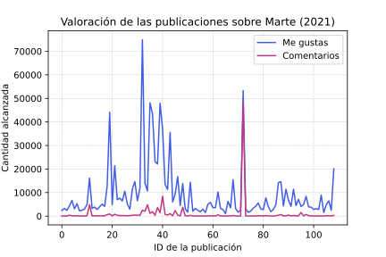
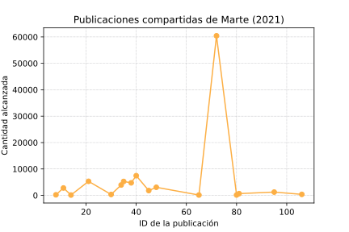
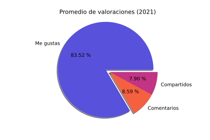
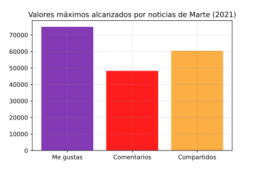
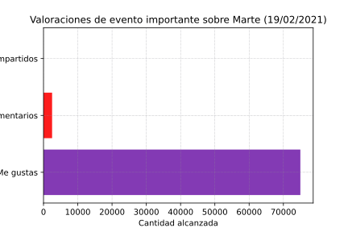

# Eventos y noticias sobre Marte.
## 1. Arquitectura

## 2. Scripts de extracción, filtrado y exportación de datos
### - Script 1 - Web Scraping
#### _(DataExtraction_WebsiteAASSky.py)_
Se recopilaron todas las publicaciones astronómicas sobre Marte desde Enero del 2020 hasta Marzo del 2021, de la página web Sky&Telescope (https://skyandtelescope.org). 
Con el objetivo de adquirir registros de datos relacionados con el tema, se implemeto un filtrado donde se extrajeron unicamente las publicaciones cuyo titulo contenía la palabra "Mars". Una vez recopilados los registros, se guardaron en la tabla "AASSky_posts" de la base de datos "mars.db".
### - Script 2 - Facebook Scraper
#### _(DataExtraction_FBPageNASA.py)_
Se recopilaron todas las publicaciones sobre Marte de la pagina de facebook de la NASA (https://www.facebook.com/NASA), en un rango de tiempo del: 1 de enero del 2021 hasta el 10 de marzo del 2021. 
Con el objetivo de adquirir registros de datos relacionados con el tema, se implemeto un filtrado donde se extrajeron unicamente las publicaciones cuyo texto contenía la palabra "Mars". Una vez recopilados los registros, se guardaron en la tabla "NASA_posts" de la base de datos "mars.db".
### - Script 3 - Exportación a .csv
#### _(ASSSky_to_csv.py)_
Se leyeron todos los registros de la tabla "NASA_posts" y se guardaron en el archivo "AASSky_posts.csv", para posteriormete poder desarrollar sus visualizaciones.
## 3. Visualizaciones y análisis
Es importante resaltar el evento del pasado 18 de Febrero del año en curso, cuando se confirmo que "El Perseverance" aterrizó exitosamente en el planeta rojo.
### - Con PowerBI
#### Publicaciones y eventos astronomicos de Sky&Telescope

**Análisis:** A pesar de los evidentes resultados de la primera gráfica, se puede evidenciar en la gráfica de una linea sombreada titulada "Recuento de publicaciones por Año", como en el rango de Enero-Marzo del 2020 y 2021 respectivamente, la cantidad publicaciones y por ende, avances e intereses astronómicos son mayores en el 2021, por lo cual se puede estimar un año con una creciente respecto al número de publicaciones y eventos de Marte. 
Gracias a la grafica circular, con un análisis exclusivamente del mes de febrero del 2021, se pudo conocer el autor con la mayor cantidad de publicaciones sobre Marte. Investigador con varias publicaciones y gran interes en Marte. 
La última gráfica estadística es reveladora, ya que representa la relevancia de las categorias de los últimos meses, y como es de conocimiento mundial, las misiones espaciales están en la cima.
### - Con Matplolib
#### Publicaciones de la página de la NASA de Facebook
      
**Análisis:** En promedio, las publicaciones sobre Marte en la red social obtienen un mayor número de "Me gustas" en comparacion a otras valoraciones. Sin embargo, en general los numeros máximos de las valoraciones revelan el gran interés que los usuarios exteriorizan a traves de una red social tan informal, como lo es Facebook. 
El punto crítico de la primera gráfica refleja la aceptación social a nivel global que tuvo el aterrizaje del "Perseverance" en Marte, ya que hace referencia a la publicación de la primera imagen a color enviada por el robot (https://www.facebook.com/NASA/posts/10158994637206772), y en función a los comentarios y publicaciones compartidas, sus puntos críticos corresponden a un video en directo que subio la NASA exponiendo todo el proceso de la misión espacial (https://www.facebook.com/watch/?v=438313177583525), mismo que tuvo miles de comentarios relevantes.
