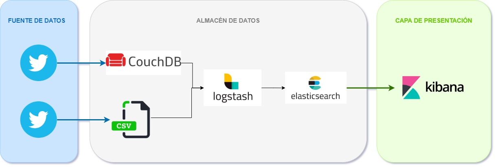

# Proyecto-Final-Analisis
## 1.     Pulso político en ciudades de Ecuador.
###

## 2.     Pulso político por provincias en Ecuador.

## 3.     Juegos en línea por países.
###

## 4.     El COVID-19 en el mundo.
###

## 5.     Eventos y noticias sobre Marte.

